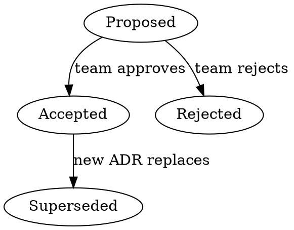

# Overview

## Overview


An ADR documents a single architecturally significant decision:
the context, the choice made, alternatives considered, and
consequences. ADRs create a decision log that preserves the
**why** behind architectural choices.

**Core principle:** One decision per ADR. Focus on the decision
and its rationale, not on implementation details.

## When to Write an ADR


Write an ADR when the decision:

- Affects system structure (monolith vs microservices, etc.)
- Constrains non-functional requirements (security, scaling)
- Changes component dependencies or coupling
- Selects frameworks, libraries, or significant tools
- Defines API contracts or integration patterns
- Is hard to reverse once implemented
- Would benefit future team members understanding "why"

**Do NOT write an ADR for:**

- Routine library version bumps
- Temporary workarounds or hotfixes
- Minor implementation choices within a bounded context
- Decisions with negligible architectural impact

## Metadata


| Field           | Value                            |
| --------------- | -------------------------------- |
| Status          | {Proposed/Accepted/Rejected/Superseded} |
| Date            | YYYY-MM-DD                       |
| Decision-makers | {names or roles}                 |
| Consulted       | {names, roles, or teams}         |
| Informed        | {names, roles, or teams}         |
| Supersedes      | {ADR-NNN or "N/A"}              |
| Superseded by   | {ADR-NNN or "N/A"}              |

## Context and Problem Statement (required)


{2-3 sentences describing the situation and challenge.
What forces are at play? What problem must be solved?
Include relevant constraints and business context.}

## Decision Drivers (required)


- {Driver 1: force, concern, or requirement}
- {Driver 2}
- {Driver 3}

## Considered Options (required)


1. {Option A}
2. {Option B}
3. {Option C}

## Decision Outcome (required)


We decided on **{Option X}** because {concise justification
tied directly to the decision drivers}.

### Confidence Level

{High/Medium/Low} - {brief explanation of confidence
and conditions that might trigger reconsideration}

### Consequences (required)

**Good:**

- Good, because {positive consequence}
- Good, because {positive consequence}

**Bad:**

- Bad, because {negative trade-off}
- Bad, because {negative trade-off}

## Pros and Cons of Each Option (required)


### Option A: {Name}

- Good, because {advantage}
- Neutral, because {observation}
- Bad, because {disadvantage}

### Option B: {Name}

- Good, because {advantage}
- Bad, because {disadvantage}

### Option C: {Name}

- Good, because {advantage}
- Bad, because {disadvantage}

## Confirmation (optional)


{How will you verify this decision is working?
Fitness functions, review dates, metrics to track.}

## More Information (optional)


{Links to related ADRs, RFCs, research, diagrams,
or meeting notes. Implementation timeline if known.}
```

## File Naming and Organization


**REQUIRED:** ADRs are markdown files. Follow writing-markdown
skill for markdownlint compliance.

**Directory:** `docs/adr/` in the project repository

**File naming:** `NNN-decision-title.md`

- NNN = zero-padded sequential number (001, 002, 003)
- Check existing ADRs in `docs/adr/` to determine next number
- Title in lowercase with hyphens, imperative verb form
- Examples: `001-use-postgresql-for-persistence.md`,
  `002-adopt-event-driven-messaging.md`

**Index file:** Maintain a `docs/adr/README.md` listing all
ADRs with their number, title, status, and date.

## Status Lifecycle




- **Proposed**: Initial state, ready for review
- **Accepted**: Approved by team, now immutable
- **Rejected**: Not approved, reason documented
- **Superseded**: Replaced by a newer ADR (link to it)

**Accepted and Rejected ADRs are immutable.** To change a
decision, create a new ADR that supersedes the old one.

## Quality Checklist


Before finalizing any ADR, verify:

- [ ] Title uses imperative verb form
- [ ] Metadata table is complete
- [ ] Context explains the problem, not the solution
- [ ] At least 2 alternatives are genuinely considered
- [ ] Decision Drivers are explicit, not implied
- [ ] Decision Outcome ties directly to drivers
- [ ] Confidence level is stated honestly
- [ ] Consequences include both good AND bad
- [ ] Each option has explicit pros and cons
- [ ] ADR is 1-2 pages max (not a design document)
- [ ] No implementation blueprints in the decision

