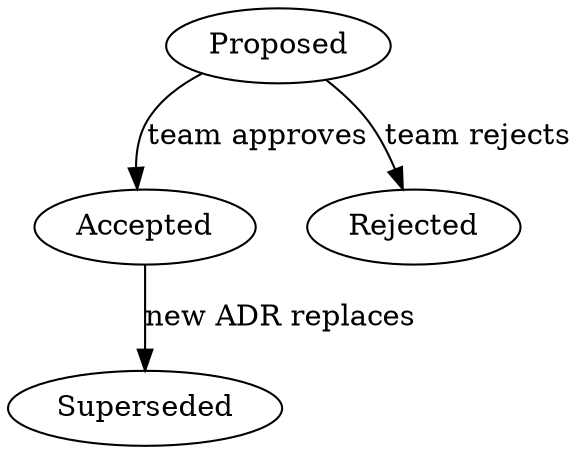

# Writing Architectural Decision Records

## Overview

An ADR documents a single architecturally significant decision:
the context, the choice made, alternatives considered, and
consequences. ADRs create a decision log that preserves the
**why** behind architectural choices.

**Core principle:** One decision per ADR. Focus on the decision
and its rationale, not on implementation details.

## When to Write an ADR

Write an ADR when the decision:

- Affects system structure (monolith vs microservices, etc.)
- Constrains non-functional requirements (security, scaling)
- Changes component dependencies or coupling
- Selects frameworks, libraries, or significant tools
- Defines API contracts or integration patterns
- Is hard to reverse once implemented
- Would benefit future team members understanding "why"

**Do NOT write an ADR for:**

- Routine library version bumps
- Temporary workarounds or hotfixes
- Minor implementation choices within a bounded context
- Decisions with negligible architectural impact

## ADR Template

Every ADR MUST follow this structure. Sections marked
(required) must always be present. Sections marked (optional)
should be included when applicable.

```markdown
# ADR-NNN: {Decision Title in Imperative Form}

## Metadata

| Field           | Value                            |
| --------------- | -------------------------------- |
| Status          | {Proposed/Accepted/Rejected/Superseded} |
| Date            | YYYY-MM-DD                       |
| Decision-makers | {names or roles}                 |
| Consulted       | {names, roles, or teams}         |
| Informed        | {names, roles, or teams}         |
| Supersedes      | {ADR-NNN or "N/A"}              |
| Superseded by   | {ADR-NNN or "N/A"}              |

## Context and Problem Statement (required)

{2-3 sentences describing the situation and challenge.
What forces are at play? What problem must be solved?
Include relevant constraints and business context.}

## Decision Drivers (required)

- {Driver 1: force, concern, or requirement}
- {Driver 2}
- {Driver 3}

## Considered Options (required)

1. {Option A}
2. {Option B}
3. {Option C}

## Decision Outcome (required)

We decided on **{Option X}** because {concise justification
tied directly to the decision drivers}.

### Confidence Level

{High/Medium/Low} - {brief explanation of confidence
and conditions that might trigger reconsideration}

### Consequences (required)

**Good:**

- Good, because {positive consequence}
- Good, because {positive consequence}

**Bad:**

- Bad, because {negative trade-off}
- Bad, because {negative trade-off}

## Pros and Cons of Each Option (required)

### Option A: {Name}

- Good, because {advantage}
- Neutral, because {observation}
- Bad, because {disadvantage}

### Option B: {Name}

- Good, because {advantage}
- Bad, because {disadvantage}

### Option C: {Name}

- Good, because {advantage}
- Bad, because {disadvantage}

## Confirmation (optional)

{How will you verify this decision is working?
Fitness functions, review dates, metrics to track.}

## More Information (optional)

{Links to related ADRs, RFCs, research, diagrams,
or meeting notes. Implementation timeline if known.}
```

## File Naming and Organization

**REQUIRED:** ADRs are markdown files. Follow writing-markdown
skill for markdownlint compliance.

**Directory:** `docs/adr/` in the project repository

**File naming:** `NNN-decision-title.md`

- NNN = zero-padded sequential number (001, 002, 003)
- Check existing ADRs in `docs/adr/` to determine next number
- Title in lowercase with hyphens, imperative verb form
- Examples: `001-use-postgresql-for-persistence.md`,
  `002-adopt-event-driven-messaging.md`

**Index file:** Maintain a `docs/adr/README.md` listing all
ADRs with their number, title, status, and date.

## Status Lifecycle



- **Proposed**: Initial state, ready for review
- **Accepted**: Approved by team, now immutable
- **Rejected**: Not approved, reason documented
- **Superseded**: Replaced by a newer ADR (link to it)

**Accepted and Rejected ADRs are immutable.** To change a
decision, create a new ADR that supersedes the old one.

## Quality Checklist

Before finalizing any ADR, verify:

- [ ] Title uses imperative verb form
- [ ] Metadata table is complete
- [ ] Context explains the problem, not the solution
- [ ] At least 2 alternatives are genuinely considered
- [ ] Decision Drivers are explicit, not implied
- [ ] Decision Outcome ties directly to drivers
- [ ] Confidence level is stated honestly
- [ ] Consequences include both good AND bad
- [ ] Each option has explicit pros and cons
- [ ] ADR is 1-2 pages max (not a design document)
- [ ] No implementation blueprints in the decision

## Anti-Patterns to Avoid

| Anti-Pattern     | Symptom                          |
| ---------------- | -------------------------------- |
| Fairy Tale       | Only pros listed, no trade-offs  |
| Sales Pitch      | Marketing language, no evidence  |
| Free Lunch       | Consequences hide real costs     |
| Dummy Alt        | Fake options to justify choice   |
| Blueprint        | Implementation details, not why  |
| Mega-ADR         | Multiple decisions in one doc    |
| Sprint           | Only one option, no alternatives |
| Tunnel Vision    | Ignores ops, maintenance, scale  |

**The #1 mistake:** Turning an ADR into a design document.
An ADR records the **decision and rationale**, not the
implementation plan. If your Decision section has code
snippets, service definitions, or deployment diagrams,
you have a blueprint, not an ADR. Move implementation
details to a separate design document and reference it
from the "More Information" section.

## Common Mistakes

- **Skipping alternatives**: Always list at least 2 real
  options. "Do nothing" counts as a valid alternative.
- **Vague context**: The context should make the problem
  obvious to someone unfamiliar with the project.
- **Missing consequences**: Every decision has downsides.
  If you cannot name any, you have not thought hard enough.
- **No confidence level**: State whether this decision was
  made with high confidence or is a best guess under
  uncertainty. Low confidence flags future review needs.
- **Combining decisions**: One ADR per decision. If you
  find yourself writing "and we also decided...", split
  it into a separate ADR.
- **Stale statuses**: Update ADR status when decisions
  are superseded. Link old and new ADRs bidirectionally.
