# Writing Mermaid Diagrams: Examples

## Contents

- [Flowchart: API Request Lifecycle](#flowchart-api-request-lifecycle)
- [Flowchart: Decision Tree with Styling](#flowchart-decision-tree-with-styling)
- [Sequence: Authentication Flow](#sequence-authentication-flow)
- [Sequence: Microservice Call Chain](#sequence-microservice-call-chain)
- [Class: Domain Model](#class-domain-model)
- [State: Order State Machine](#state-order-state-machine)
- [ER: E-commerce Schema](#er-e-commerce-schema)
- [Gantt: Sprint Plan](#gantt-sprint-plan)
- [GitGraph: Feature Branch Workflow](#gitgraph-feature-branch-workflow)
- [Mindmap: System Architecture](#mindmap-system-architecture)
- [Architecture: Cloud Infrastructure](#architecture-cloud-infrastructure)
- [C4: System Context](#c4-system-context)
- [Quadrant: Technology Prioritization](#quadrant-technology-prioritization)

---

## Flowchart: API Request Lifecycle

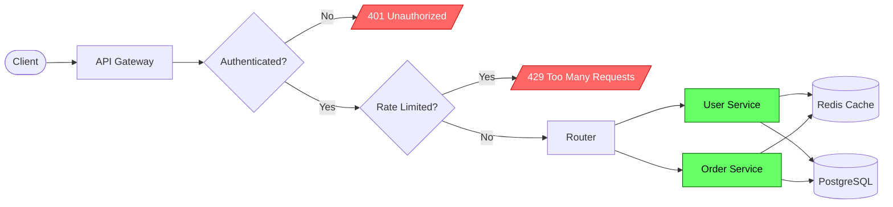

**When to use:** Showing how a request travels through a system;
identifying branch points, services, and storage.

---

## Flowchart: Decision Tree with Styling

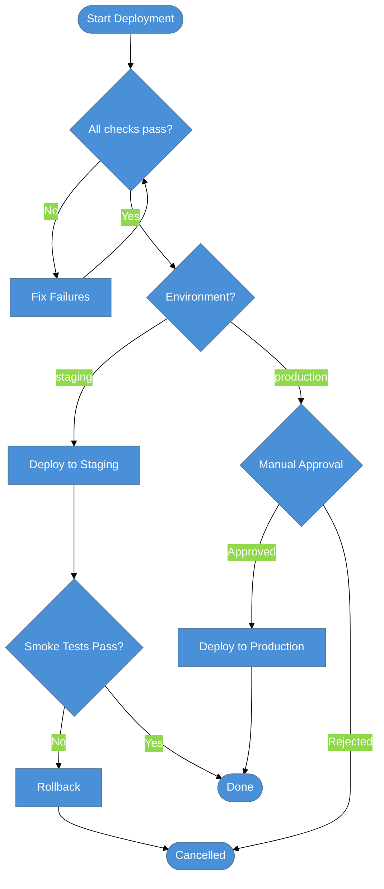

**When to use:** Deployment pipelines, approval workflows, branching
decision processes.

---

## Sequence: Authentication Flow

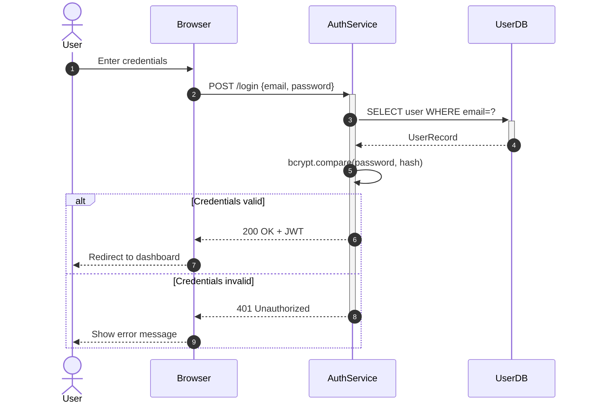

**When to use:** Login flows, OAuth flows, any time-ordered interaction
between a user and backend services.

---

## Sequence: Microservice Call Chain

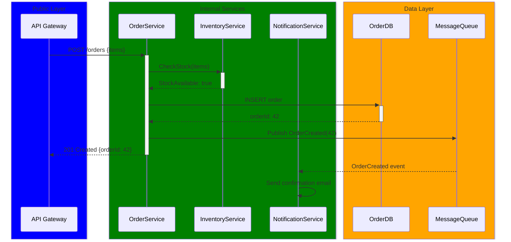

**When to use:** Documenting async message flows, multi-service
interactions, or event-driven architectures.

---

## Class: Domain Model

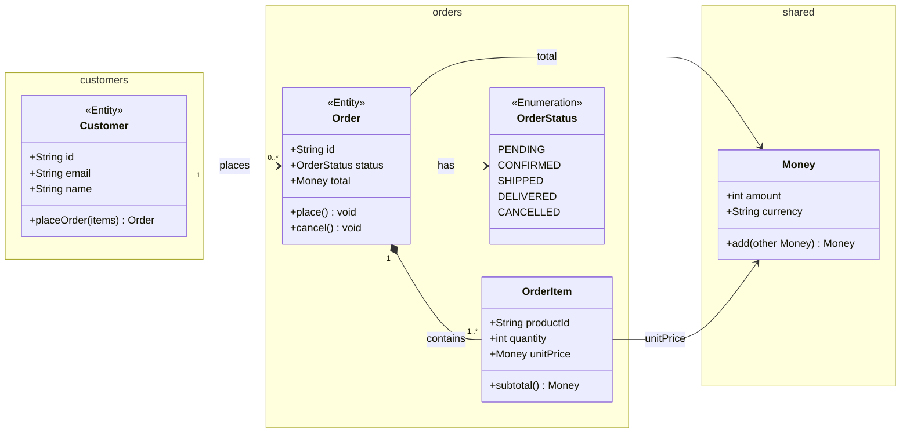

**When to use:** Domain modeling, codebase documentation, class
hierarchy explanation.

---

## State: Order State Machine

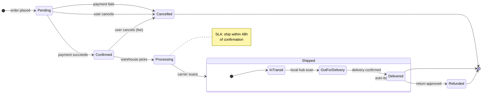

**When to use:** Documenting state machines, lifecycle management,
order/ticket/workflow status systems.

---

## ER: E-commerce Schema

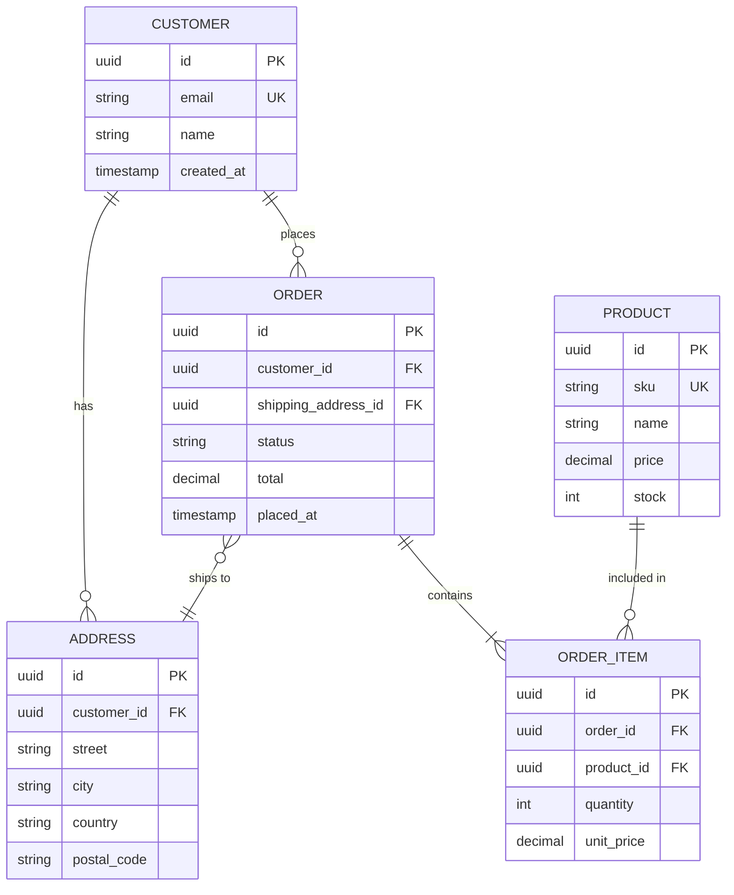

**When to use:** Database schema documentation, data model reviews,
onboarding new engineers.

---

## Gantt: Sprint Plan

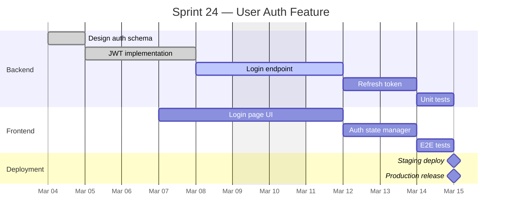

**When to use:** Sprint planning visualization, project roadmaps,
dependency tracking between parallel work streams.

---

## GitGraph: Feature Branch Workflow

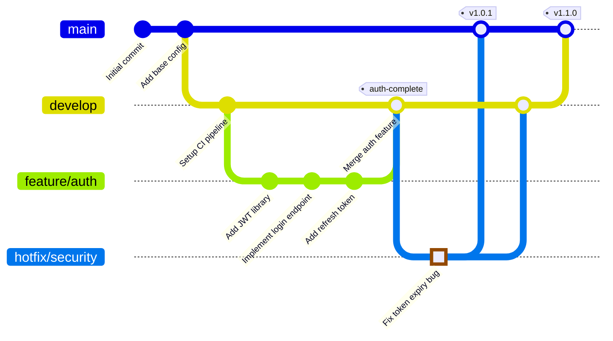

**When to use:** Explaining branching strategies, documenting release
processes, illustrating git workflows for teams.

---

## Mindmap: System Architecture

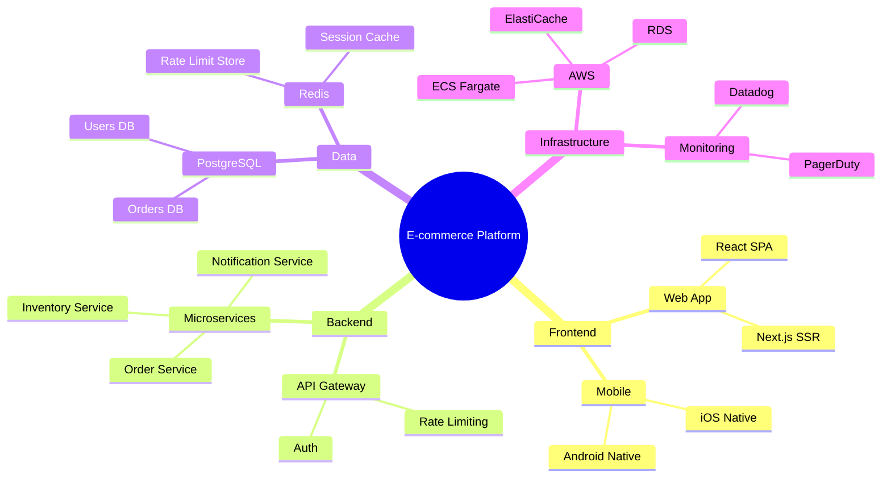

**When to use:** System overview, onboarding documentation, tech stack
exploration, brainstorming.

---

## Architecture: Cloud Infrastructure

**When to use:** Cloud infrastructure documentation, architecture
reviews, infrastructure-as-code planning.

---

## C4: System Context

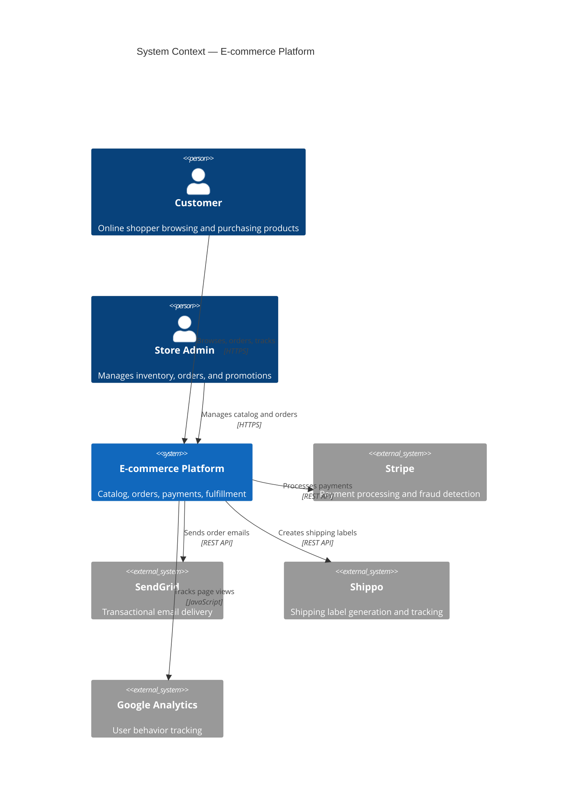

**When to use:** System boundary documentation, stakeholder
communication, identifying external dependencies.

---

## Quadrant: Technology Prioritization

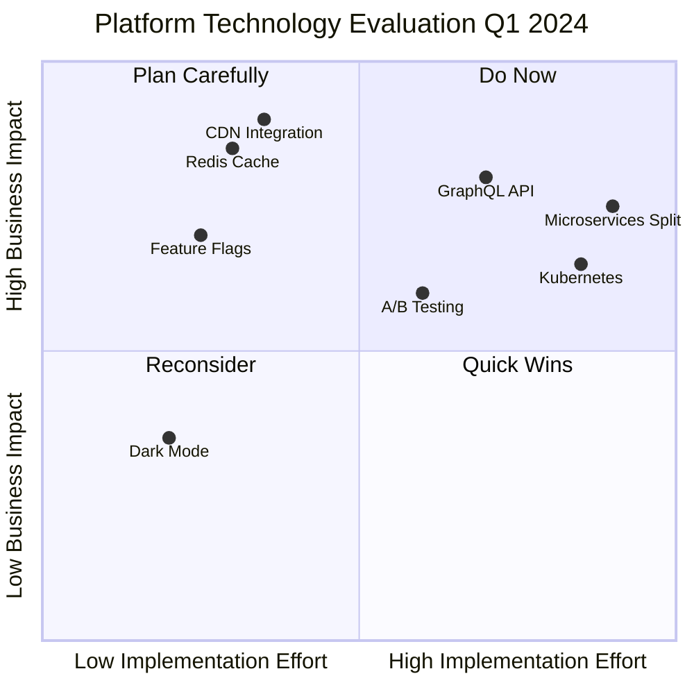

**When to use:** Prioritization discussions, technology radar,
effort-vs-impact analysis for roadmap planning.
