# Writing Mermaid Diagrams: Full Reference

## Contents

- [Diagram Type Selection](#diagram-type-selection)
- [Core Syntax Rules](#core-syntax-rules)
- [Flowchart](#flowchart)
- [Sequence Diagram](#sequence-diagram)
- [Class Diagram](#class-diagram)
- [State Diagram](#state-diagram)
- [ER Diagram](#er-diagram)
- [Gantt Chart](#gantt-chart)
- [GitGraph](#gitgraph)
- [Pie Chart](#pie-chart)
- [Mindmap](#mindmap)
- [Timeline](#timeline)
- [Quadrant Chart](#quadrant-chart)
- [XY Chart](#xy-chart)
- [Sankey Diagram](#sankey-diagram)
- [Block Diagram](#block-diagram)
- [Packet Diagram](#packet-diagram)
- [Architecture Diagram](#architecture-diagram)
- [C4 Diagrams](#c4-diagrams)
- [Other Diagram Types](#other-diagram-types)
- [Theming and Configuration](#theming-and-configuration)
- [Integration Guide](#integration-guide)
- [Best Practices](#best-practices)

---

## Diagram Type Selection

| Goal | Diagram Type | Keyword |
| --- | --- | --- |
| Process flow, decision tree | Flowchart | `flowchart` |
| Time-ordered component interactions | Sequence | `sequenceDiagram` |
| Object-oriented structure | Class | `classDiagram` |
| Application state machine | State | `stateDiagram-v2` |
| Database schema | Entity-Relationship | `erDiagram` |
| Project schedule | Gantt | `gantt` |
| Git branching strategy | Git graph | `gitGraph` |
| Proportional composition | Pie | `pie` |
| Hierarchical brainstorming | Mindmap | `mindmap` |
| Historical events | Timeline | `timeline` |
| Two-axis prioritization (2x2) | Quadrant | `quadrantChart` |
| Bar or line numerical data | XY Chart | `xychart` |
| Flow volumes between nodes | Sankey | `sankey` |
| Network packet structure | Packet | `packet` |
| Infrastructure layout | Architecture | `architecture-beta` |
| C4 software architecture | C4 | `C4Context` / `C4Container` |
| UX step-by-step journey | User Journey | `journey` |
| Multi-axis comparison | Radar | `radar-beta` |
| Hierarchical proportions | Treemap | `treemap-beta` |
| Set overlaps | Venn | `venn-beta` |
| Requirements traceability | Requirements | `requirementDiagram` |
| Kanban board | Kanban | `kanban` |

---

## Core Syntax Rules

### Starting a Diagram

Every diagram starts with its type keyword on line 1:


### Configuration: YAML Frontmatter (v10.5.0+, Preferred)

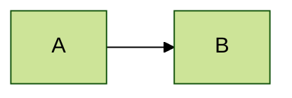

The opening `---` must be the only content on line 1. Use 2-space
YAML indentation throughout. Misspelled keys are silently ignored.
Malformed YAML breaks the diagram.

### Configuration: Directives (Legacy)

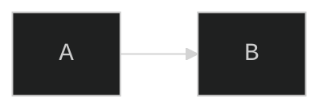

Both `init` and `initialize` keywords work.

### Comments

```mermaid
flowchart LR
  %% This is a comment
  A --> B  %% inline comment
```

### Special Character Escaping

Mermaid uses its own entity encoding — NOT standard HTML entities.

| Character | Escaped form |
| --- | --- |
| `#` | `#35;` |
| `;` | `#59;` |
| `"` | `#quot;` |

Rules:

- Wrap labels containing `(`, `)`, `[`, `]`, `{`, `}`, `|`, `/`,
  `\`, `>`, `<` in double quotes.
- Use `#35;` inside quoted strings for `#`.
- Do NOT use `&#35;` — Mermaid renders that literally.
- Text copy-pasted from PDFs or Word documents often contains smart
  quotes (`"` `"` `'` `'`) and em-dashes (`—`) that cause parse
  failures — retype or sanitize first.

Safe characters for node IDs: `[A-Za-z0-9_]` only.

### Markdown Strings in Labels (v10.2.0+)

Flowcharts and mindmaps support Markdown-formatted text inside
backtick pairs:

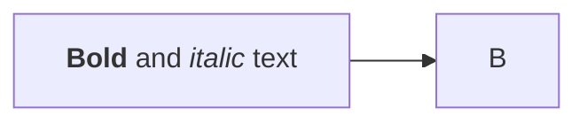

Text inside backtick labels wraps automatically.

---

## Flowchart

### Declaration

```mermaid
flowchart TD   %% top-down (same as TB)
flowchart BT   %% bottom-up
flowchart LR   %% left-right (best for process flows)
flowchart RL   %% right-left
```

### Node Shapes

| Syntax | Shape |
| --- | --- |
| `A[text]` | Rectangle |
| `A(text)` | Rounded rectangle |
| `A([text])` | Stadium / pill |
| `A[[text]]` | Subroutine |
| `A[(text)]` | Cylindrical (database) |
| `A((text))` | Circle |
| `A(((text)))` | Double circle |
| `A>text]` | Asymmetric flag |
| `A{text}` | Rhombus / diamond |
| `A{{text}}` | Hexagon |
| `A[/text/]` | Parallelogram (lean right) |
| `A[\text\]` | Parallelogram (lean left) |
| `A[/text\]` | Trapezoid (wider top) |
| `A[\text/]` | Trapezoid (wider bottom) |

Extended shapes via `@{ shape: ... }` (v11.3.0+):
`rect`, `circle`, `stadium`, `diam`, `hex`, `cyl`, `db`, `doc`,
`delay`, `cloud`, `bolt`, `flag`, `tri`, `card`, `dbl-circ`.

### Edge Types

| Syntax | Description |
| --- | --- |
| `A --> B` | Arrow |
| `A --- B` | Open line |
| `A -.-> B` | Dotted arrow |
| `A ==> B` | Thick arrow |
| `A ~~~ B` | Invisible link (forces layout) |
| `A -->o B` | Arrow with circle at B |
| `A -->x B` | Arrow with cross at B |
| `A <--> B` | Bidirectional |
| `A o--o B` | Circle on both ends |

Add extra dashes/dots to increase edge length in the layout:
`A ---> B`, `A ----> B`, `A -..-> B`, `A ===> B`.

### Edge Labels

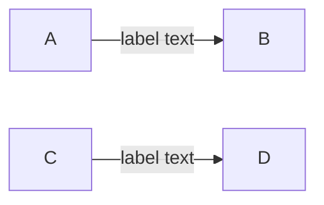

### Subgraphs

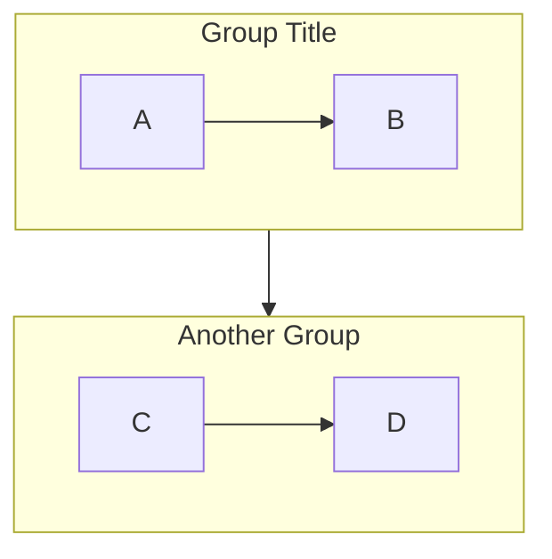

Note: subgraph `direction` is ignored when any subgraph node links
outside the subgraph.

### Styling

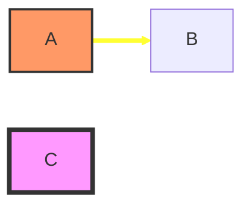

Default class overrides all unclassed nodes:
`classDef default fill:#f0f0f0`.

Curve types: `basis`, `cardinal`, `linear`, `monotoneX`, `natural`,
`step`, `stepBefore`, `stepAfter`.

### Click Events

```mermaid
flowchart LR
  click nodeId "https://example.com" "Tooltip" _blank
  click nodeId callback "Tooltip"
```

---

## Sequence Diagram

### Sequence: Declaration

```mermaid
sequenceDiagram
```

### Participants and Actors

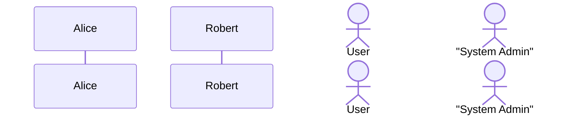

### Message Arrow Types

| Syntax | Appearance |
| --- | --- |
| `A->B: msg` | Solid line, no arrowhead |
| `A-->B: msg` | Dotted line, no arrowhead |
| `A->>B: msg` | Solid line with arrowhead |
| `A-->>B: msg` | Dotted line with arrowhead |
| `A-xB: msg` | Solid line with cross |
| `A--xB: msg` | Dotted line with cross |
| `A-)B: msg` | Solid async arrow |
| `A--)B: msg` | Dotted async arrow |
| `A<<->>B: msg` | Solid bidirectional (v11+) |

### Activation, Notes, Autonumber

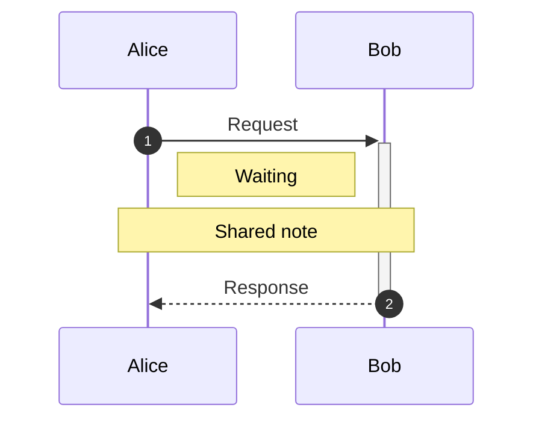

### Grouping Constructs

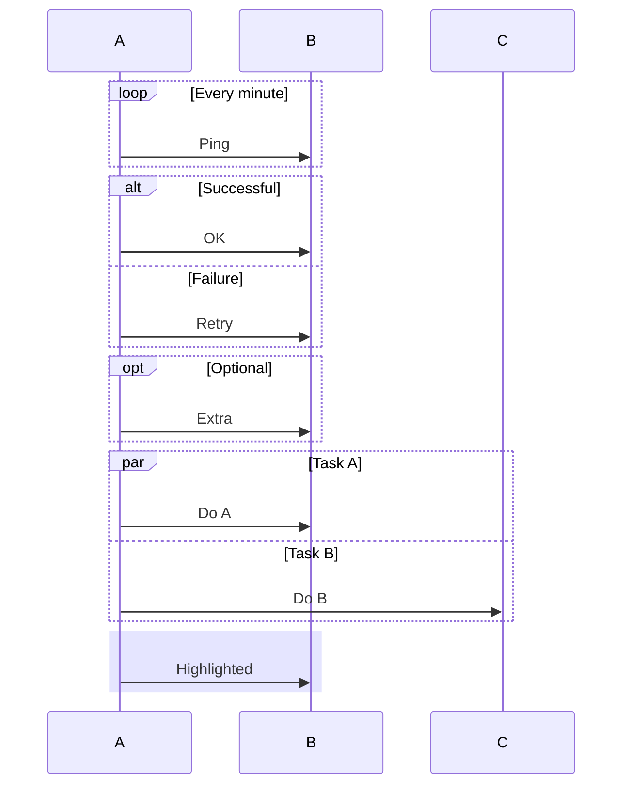

### Box Grouping

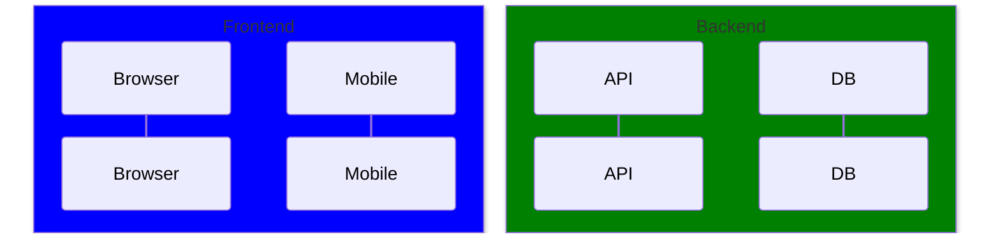

Color can be a CSS named color, `rgb(r,g,b)`, `rgba(r,g,b,a)`, or
`transparent`.

---

## Class Diagram

### Class: Declaration

```mermaid
classDiagram
```

### Class Members

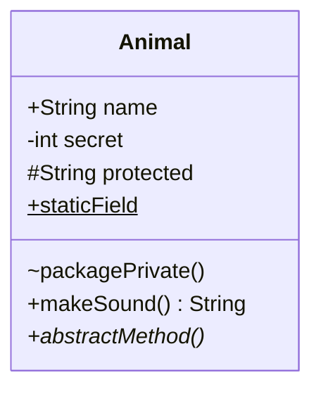

Visibility: `+` public, `-` private, `#` protected, `~` package.
Classifiers: `*` abstract, `$` static.

### Relationships

| Notation | Meaning |
| --- | --- |
| `A <\|-- B` | Inheritance (B extends A) |
| `A *-- B` | Composition |
| `A o-- B` | Aggregation |
| `A --> B` | Association |
| `A -- B` | Solid link |
| `A ..> B` | Dependency |
| `A ..\|> B` | Realization |
| `A .. B` | Dashed link |

With cardinality and label:

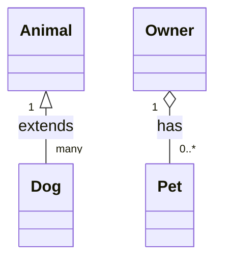

### Annotations, Namespaces, Direction

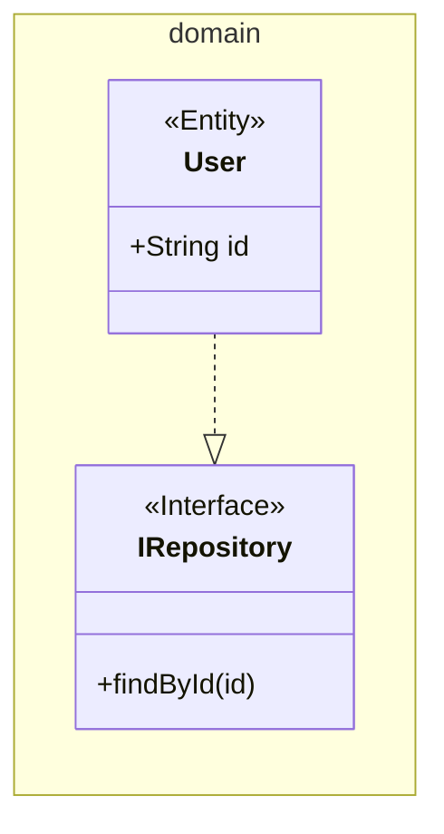

Annotations: `<<Interface>>`, `<<Abstract>>`, `<<Enumeration>>`,
`<<Service>>`, or any custom string.

---

## State Diagram

Use `stateDiagram-v2` (preferred over legacy `stateDiagram`).

### Basic States

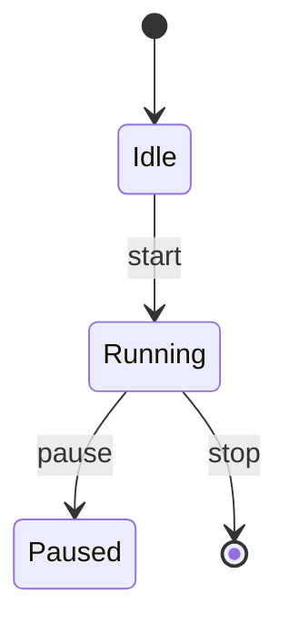

### Composite, Concurrency, Fork/Join

```mermaid
stateDiagram-v2
  state Active {
    [*] --> Idle
    Idle --> Processing : trigger
    --
    [*] --> Listening
  }
  state fork_state <<fork>>
  state join_state <<join>>
  [*] --> fork_state
  fork_state --> StateA
  fork_state --> StateB
  StateA --> join_state
  StateB --> join_state
  join_state --> [*]
```

`--` separates concurrent (parallel) regions inside a composite state.

### Notes, Choice, Direction

```mermaid
stateDiagram-v2
  direction LR
  state "Is valid?" as isValid <<choice>>
  [*] --> isValid
  isValid --> Success : yes
  isValid --> Failure : no
  Running --> Idle : timeout
  note right of Running
    Max execution: 30s
  end note
```

---

## ER Diagram

### Relationship Syntax

```mermaid
ENTITY1 CARDINALITY_LEFT--CARDINALITY_RIGHT ENTITY2 : "label"
```

`--` = identifying (solid), `..` = non-identifying (dashed).

### Cardinality Notation

| Left | Right | Meaning |
| --- | --- | --- |
| `\|o` | `o\|` | Zero or one |
| `\|\|` | `\|\|` | Exactly one |
| `}o` | `o{` | Zero or more |
| `}\|` | `\|{` | One or more |

### Attributes

```mermaid
erDiagram
  CUSTOMER {
    string id PK
    string email UK
    string name
    date created_at "account creation"
  }
  ORDER {
    string id PK
    string customer_id FK
    float total
  }
  CUSTOMER ||--o{ ORDER : places
  ORDER ||--|{ LINE_ITEM : contains
```

---

## Gantt Chart

### Structure

```mermaid
gantt
  title Project Schedule
  dateFormat  YYYY-MM-DD
  axisFormat  %b %d
  excludes    weekends

  section Planning
    Requirements : done, req1, 2024-01-01, 5d
    Design       : active, des1, after req1, 7d

  section Development
    Backend  : crit, dev1, after des1, 14d
    Frontend : dev2, after des1, 10d
    Release  : milestone, rel1, after dev1, 0d
```

Task syntax: `Title : [tags,] [id,] [start,] [duration]`

Tags: `done`, `active`, `crit`, `milestone` (comma-separated).

Start: absolute date, `after taskId`, or `until taskId`.

Duration: `5d`, `2w`, `3h`, `1m`.

`tickInterval` options: `1second`, `1minute`, `1hour`, `1day`,
`1week`, `1month`.

Compact mode (multiple tasks per row):

```yaml
---
config:
  gantt:
    displayMode: compact
---
```

---

## GitGraph

### Commands

```mermaid
gitGraph
  commit
  commit id: "feat-1" tag: "v0.1" type: HIGHLIGHT
  branch develop
  checkout develop
  commit
  commit id: "fix-1" type: REVERSE
  checkout main
  merge develop id: "merge-1" tag: "v1.0"
  cherry-pick id: "fix-1"
```

Commit types: `NORMAL` (circle), `REVERSE` (crossed), `HIGHLIGHT`
(rectangle).

Orientation: `gitGraph LR:` (default), `gitGraph TB:`, `gitGraph BT:`.

Branch ordering: `branch feature order: 1`

---

## Pie Chart

```mermaid
pie showData title "Browser Share"
  "Chrome"  : 65.7
  "Safari"  : 18.9
  "Firefox" : 4.1
  "Edge"    : 4.0
```

- Values must be positive.
- Labels must be in double quotes.
- `showData` displays raw values in the legend.
- Slices render clockwise in listed order.

---

## Mindmap

```mermaid
mindmap
  root((Central Topic))
    Branch A
      Leaf A1
      Leaf A2
    Branch B
      "`**Bold** leaf`"
      Item:::urgent
```

Hierarchy via indentation. Node shapes: `text` (default), `[rect]`,
`(rounded)`, `((circle))`, `)bang(`, `{{hex}}`.

Icons: `Topic::icon(fa fa-star)`. Classes: `Item:::className`.

---

## Timeline

```mermaid
timeline
  title Technology Milestones
  section 1990s
    1991 : WWW goes public
    1995 : JavaScript created
  section 2000s
    2004 : Facebook launched
         : Gmail launched
    2007 : iPhone released
```

Multiple events per period: repeat the period with `:` on subsequent
indented lines.

---

## Quadrant Chart

```mermaid
quadrantChart
  title Technology Evaluation
  x-axis Low Complexity --> High Complexity
  y-axis Low Value --> High Value
  quadrant-1 Invest
  quadrant-2 Automate
  quadrant-3 Eliminate
  quadrant-4 Delegate
  Tool A: [0.8, 0.9]
  Tool B: [0.3, 0.7]
```

Coordinates are in `[0.0, 1.0]` range. Quadrant 1 = top-right,
2 = top-left, 3 = bottom-left, 4 = bottom-right.

---

## XY Chart

```mermaid
xychart
  title "Monthly Revenue"
  x-axis [Jan, Feb, Mar, Apr, May, Jun]
  y-axis "Revenue ($K)" 0 --> 150
  bar [45, 62, 78, 55, 90, 120]
  line [50, 58, 72, 60, 88, 115]
```

Use `xychart horizontal` for horizontal bars.

Numeric x-axis: `x-axis "Month" 1 --> 12`

Multiple series: overlay `bar` and `line` in the same diagram.

---

## Sankey Diagram

```mermaid
sankey
source,target,value
Energy,Electricity,200
Energy,Heat,150
Electricity,Homes,80
```

CSV format. Wrap fields with commas in double quotes. Literal double
quotes use paired quotes inside the field.

Key config options:

| Option | Values |
| --- | --- |
| `linkColor` | `source`, `target`, `gradient`, or hex |
| `nodeAlignment` | `justify`, `center`, `left`, `right` |
| `showValues` | `true` / `false` |

---

## Block Diagram

```mermaid
block
  columns 3
  A["Component A"]
  B["Component B"]
  C:2["Wide Component"]
  A --> B
  B --> C
```

`:2` suffix spans 2 columns. Same shapes as flowchart nodes.

---

## Packet Diagram

```mermaid
packet
  0-7: "Version"
  8-15: "IHL"
  16-31: "Total Length"
  96-127: "Source IP"
```

Incremental syntax (v11.7.0+): `+8: "Type"` increments 8 bits from
the previous field's end.

---

## Architecture Diagram

```mermaid
architecture-beta
  group vpc(cloud)[VPC]
  service lb(internet)[Load Balancer] in vpc
  service web(server)[Web Server] in vpc
  service db(database)[PostgreSQL] in vpc

  lb:R --> L:web
  web:R --> L:db
```

Service syntax: `service {id}({icon})[{label}]` or add `in {groupId}`.

Edge direction tokens: `T` (top), `B` (bottom), `L` (left), `R`
(right). Format: `svcA:R --> L:svcB`.

Built-in icons: `cloud`, `database`, `disk`, `internet`, `server`.

---

## C4 Diagrams

```mermaid
C4Context
  title System Context
  Person(customer, "Customer", "A shopper")
  System(shop, "Shop System", "Handles orders")
  System_Ext(payment, "Stripe", "Payment gateway")
  Rel(customer, shop, "Places orders")
  Rel(shop, payment, "Processes payments")
```

Types: `C4Context`, `C4Container`, `C4Component`, `C4Dynamic`,
`C4Deployment`.

Elements: `Person`, `System`, `System_Ext`, `Container`,
`ContainerDb`, `Component`.

Boundaries: `Boundary(id, "label", "type") { ... }`.

Relationships: `Rel`, `BiRel`, `Rel_U`, `Rel_D`, `Rel_L`, `Rel_R`.

Styling: `UpdateElementStyle(id, $bgColor="#hex")`,
`UpdateRelStyle(id1, id2, $textColor="#hex")`.

---

## Other Diagram Types

### User Journey

```mermaid
journey
  title Shopping Journey
  section Discovery
    Search: 5: Customer
    Browse: 4: Customer
  section Purchase
    Checkout: 3: Customer, Support
    Payment: 2: Customer
```

Task syntax: `Description: score: actor1, actor2`
Score: 1 (very negative) to 5 (very positive).

### Radar (v11.6.0+)

```mermaid
radar-beta
  title Skills
  axis Communication, Technical, Leadership
  curve Alice{4, 3, 5}
  curve Bob{3, 5, 2}
```

Config: `showLegend`, `max`, `min`, `graticule` (`circle` or
`polygon`), `ticks`.

### Treemap

```mermaid
treemap-beta
  "Budget"
    "Engineering": 500000
    "Marketing"
      "Digital": 100000
      "Events": 50000
```

Hierarchy via indentation. Leaf nodes end with `: number`. Parent
nodes have no value.

### Venn (v11.12.3+)

```mermaid
venn-beta
  set A["Python Devs"]
  set B["JS Devs"]
  union A,B["Full-Stack"]
```

Size: `set A:5`, `union A,B:2`.

### Requirements Diagram

```mermaid
requirementDiagram
  requirement user_auth {
    id: REQ-001
    text: The system shall authenticate users
    risk: High
    verifymethod: Test
  }
  element auth_module {
    type: module
    docref: SRS-2.1
  }
  user_auth satisfies auth_module
```

Types: `requirement`, `functionalRequirement`, `performanceRequirement`,
`designConstraint`.

Relationships: `contains`, `satisfies`, `verifies`, `traces`.

### Kanban

```mermaid
kanban
  todo[To Do]
    task1[Write tests]
      @{ assigned: alice, priority: High }
  inprogress[In Progress]
    task2[Implement login]
      @{ assigned: alice, priority: Very High }
  done[Done]
    task3[Set up CI]
```

Priority values: `Very High`, `High`, `Low`, `Very Low`.

### ZenUML

```mermaid
zenuml
  @Actor Alice
  @Boundary FE as "Frontend"
  @Database DB

  Alice -> FE.login(user, pass) {
    FE -> DB.findUser(user) {
      return userRecord
    }
    return JWT
  }
```

Control flow: `if`, `else`, `while`, `for`, `loop`, `opt`, `par`,
`try`, `catch`. Requires separate registration via JavaScript API.

---

## Theming and Configuration

### Built-in Themes

| Theme | Best For |
| --- | --- |
| `default` | General purpose, light |
| `neutral` | Print / black-and-white |
| `dark` | Dark mode |
| `forest` | Documentation, green |
| `base` | Custom themes (only modifiable one) |

Apply via frontmatter:

```yaml
---
config:
  theme: dark
---
```

### Custom Theme Variables (base theme only)

```yaml
---
config:
  theme: base
  themeVariables:
    primaryColor: '#ff6600'
    primaryTextColor: '#ffffff'
    primaryBorderColor: '#cc4400'
    secondaryColor: '#006699'
    tertiaryColor: '#f0f0f0'
    fontSize: '16px'
    fontFamily: 'Inter, sans-serif'
    background: '#ffffff'
---
```

All values must be hex color codes — CSS named colors are silently
ignored.

### Layout Engines

```yaml
---
config:
  layout: elk
---
```

Options: `dagre` (default), `elk` (better for complex graphs with
many crossing edges).

---

## Integration Guide

### GitHub / GitLab

Native rendering — use a fenced code block with `mermaid` as the
language tag:

````markdown
```mermaid
flowchart LR
  A --> B
```
````

No configuration required in GitHub or GitLab markdown, wikis,
issues, or pull requests.

### VS Code

- **Markdown Preview Mermaid Support** (`bierner.markdown-mermaid`)
  renders in built-in Markdown Preview (`Cmd+Shift+V`).
- **Mermaid Preview** (official Mermaid Chart extension) — side-by-
  side preview with syntax highlighting; supports `.mmd` files.

### Notion

Insert a Code block (`/code`), set language to `Mermaid`, paste the
definition. Notion renders it inline.

### Confluence

- **Mermaid Chart for Confluence** (Atlassian Marketplace, official)
- **Mermaid Diagrams for Confluence** (third-party, code-only)

### Mermaid CLI (mmdc)

```bash
npm install -g @mermaid-js/mermaid-cli
mmdc -i diagram.mmd -o diagram.svg
mmdc -i diagram.mmd -o diagram.png -t dark -b transparent
mmdc -i diagram.mmd -o diagram.png -s 3 -w 2400
```

Key flags:

| Flag | Description |
| --- | --- |
| `-i` | Input file or `-` for stdin |
| `-o` | Output file |
| `-t` | Theme: `default`, `dark`, `forest`, `neutral` |
| `-b` | Background: `transparent`, `white`, or hex |
| `-w` | Width in pixels (default 800) |
| `-H` | Height in pixels (default 600) |
| `-s` | Scale / device pixel ratio |
| `-c` | JSON config file |
| `-C` | Custom CSS file |

---

## Best Practices

### Choosing the Right Diagram Type

Choose the diagram type that matches the question, not the tool you
know best. A flowchart used for a database schema is harder to read
than an ER diagram.

### Node IDs vs Labels

- Keep IDs short and safe: `userService` not `User Service API`.
- Put the full description in the label: `userService[User Service API]`.
- IDs must be unique within the diagram.

### Readability

- Declare all nodes with labels first, then define relationships.
- Use subgraphs to group related nodes.
- One statement per line; avoid long chained expressions.
- Add `%%` comments to explain non-obvious flows.
- Prefer `LR` direction for process flows; `TD` for hierarchies.

### Long Labels

- Wrap in `["full label text"]` with quotes.
- Use Markdown strings for multi-line or formatted labels (flowchart
  and mindmap only).
- Keep labels under ~50 characters; split conceptually if longer.

### Style Management

- Use `classDef` for reusable styles, not per-node `style` rules.
- Apply `classDef` only to nodes that exist in the diagram.
- `linkStyle` indexes are zero-based, ordered by definition sequence.

### Security

Always set `securityLevel: 'strict'` when rendering user-generated
content. It disables JavaScript in diagrams, preventing XSS attacks.

```javascript
mermaid.initialize({ securityLevel: 'strict' });
```
