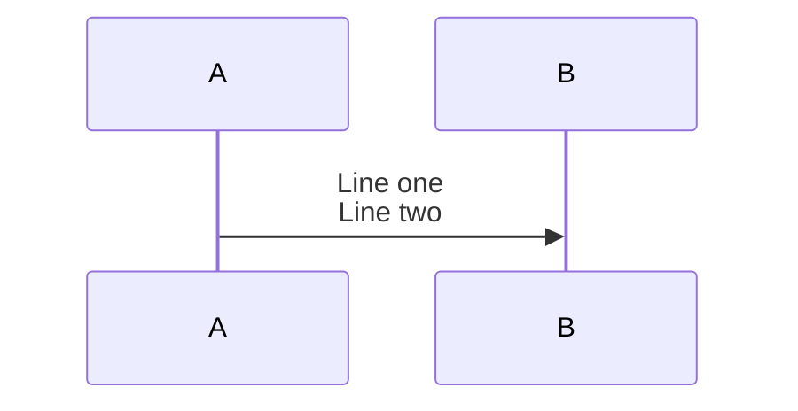
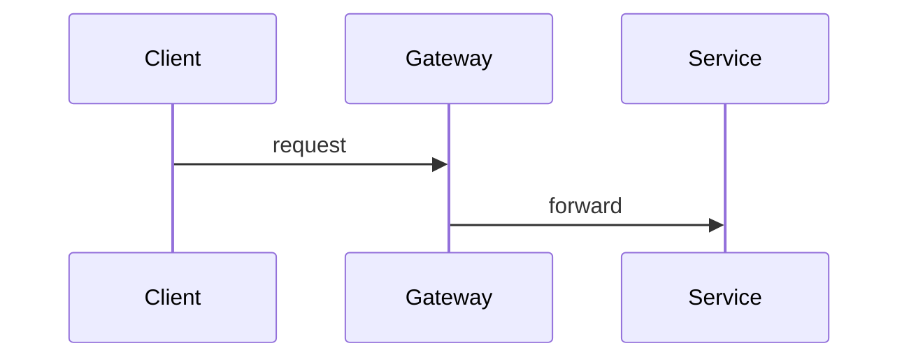
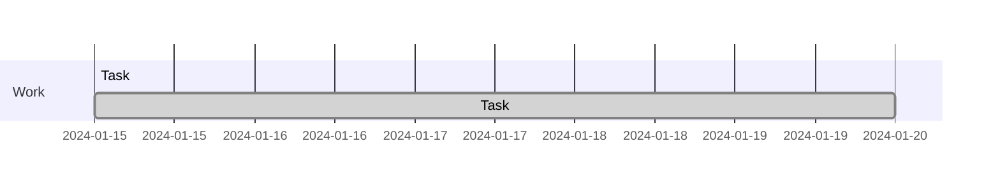
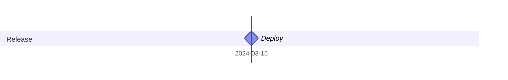
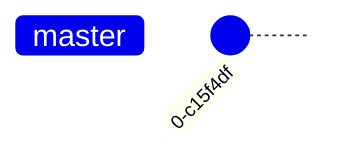
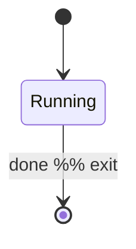
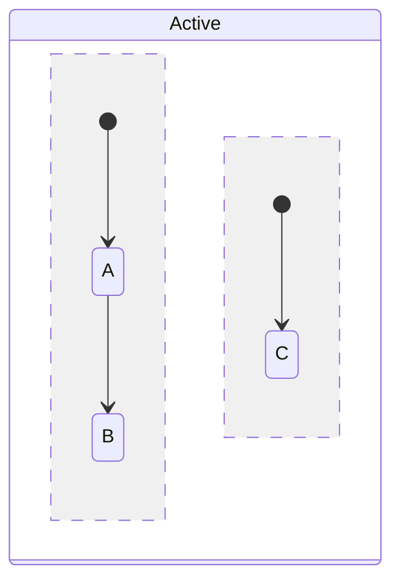

# Writing Mermaid Diagrams: Troubleshooting

## Contents

- [Parse Errors](#parse-errors)
- [Node and ID Issues](#node-and-id-issues)
- [Subgraph Issues](#subgraph-issues)
- [Sequence Diagram Issues](#sequence-diagram-issues)
- [ER Diagram Issues](#er-diagram-issues)
- [Gantt Issues](#gantt-issues)
- [GitGraph Issues](#gitgraph-issues)
- [State Diagram Issues](#state-diagram-issues)
- [Styling Issues](#styling-issues)
- [Configuration Issues](#configuration-issues)
- [Rendering and Integration Issues](#rendering-and-integration-issues)
- [Anti-Patterns to Avoid](#anti-patterns-to-avoid)

---

## Parse Errors

### "Syntax error in text" / "Parse error on line N"

**Most common causes:**

1. **Unquoted special characters in labels.**
   Wrap any label containing `(`, `)`, `[`, `]`, `{`, `}`, `|`,
   `/`, `\`, `>`, `<` in double quotes.

   ```mermaid
   %% Wrong
   flowchart LR
     A[Process (step 1)] --> B

   %% Correct
   flowchart LR
     A["Process (step 1)"] --> B
   ```

2. **Reserved word used as a node ID.**
   Reserved words: `end`, `subgraph`, `class`, `style`, `direction`,
   `linkStyle`, `classDef`, `click`, `note`, `loop`, `alt`, `else`,
   `opt`, `par`, `and`, `rect`, `participant`, `actor`.

   ```mermaid
   %% Wrong — 'end' is reserved
   flowchart LR
     end --> done

   %% Correct
   flowchart LR
     endState[End] --> done
   ```

3. **Smart quotes or non-ASCII characters.**
   Text copy-pasted from Word, PDFs, or Notion often contains `"`,
   `"`, `'`, `'`, `—`, or non-breaking spaces. These are invisible
   but break parsing. Retype the affected text from scratch.

4. **Unbalanced brackets.**
   Every `[`, `(`, `{`, `"` must have a matching close character on
   the same line.

5. **`end` keyword not on its own line.**

   ```mermaid
   %% Wrong
   subgraph sg[Group] A --> B end

   %% Correct
   subgraph sg[Group]
     A --> B
   end
   ```

6. **Missing diagram type keyword.**
   The first non-blank line must be the diagram keyword:
   `flowchart LR`, `sequenceDiagram`, `classDiagram`, etc.

---

## Node and ID Issues

### Two Nodes Render as One

**Cause:** Two nodes share the same ID. Mermaid merges them.

```mermaid
%% Wrong — both have ID 'A'; they merge
flowchart LR
  A[Start] --> B[Process]
  A[End] --> C[Done]

%% Correct
flowchart LR
  startNode[Start] --> process[Process]
  endNode[End] --> done[Done]
```

**Rule:** Every node must have a unique ID within the diagram.

### Node Label Not Displaying Correctly

**Cause:** Special characters unquoted, or using HTML entities
instead of Mermaid entities.

```mermaid
%% Wrong — HTML entity, renders literally
A[Tax &#35; Line]

%% Correct — Mermaid entity
A["Tax #35; Line"]

%% Also correct — avoid the character
A["Tax Number Line"]
```

### Hyphen in Node ID Causes Error

**Cause:** Hyphens are not allowed in node IDs.

```mermaid
%% Wrong
user-service[User Service] --> api-gateway

%% Correct
userService[User Service] --> apiGateway
```

---

## Subgraph Issues

### Subgraph Does Not Render

**Cause:** Missing `end` keyword or `end` not on its own line.

```mermaid
%% Wrong
subgraph sg[Group]
  A --> B
  end C --> D  %% 'end' must be alone

%% Correct
subgraph sg[Group]
  A --> B
end
C --> D
```

### Subgraph `direction` Ignored

**Cause:** When a node inside the subgraph links to a node outside
it, Mermaid overrides the subgraph direction. This is expected
behavior and cannot be worked around without restructuring the
diagram.

### Subgraph Title Contains "end"

Subgraph titles (and any labels) that contain the word `end` must
be quoted:

```mermaid
subgraph sg["end phase"]
  A --> B
end
```

---

## Sequence Diagram Issues

### Line Break in Message Text Not Working

Use `<br>` for line breaks in message labels. Plain newlines inside
message text are not supported.



### Activation Arrows Not Closing

Each `+` activation must be closed with a matching `-` deactivation.

```mermaid
%% Wrong — mismatched + and -
A->>+B: start
A->>+B: another
B-->>-A: done  %% only one - for two +

%% Correct
A->>+B: start
B-->>-A: first response
A->>+B: another
B-->>-A: second response
```

### Participant Order Wrong

Participants render in declaration order. Undeclared participants
render in order of first appearance. Declare explicitly to control
order:



---

## ER Diagram Issues

### Parse Error on Cardinality Notation

Mermaid uses pipe/brace notation, not `1:*` or `one-to-many` text.

| Wrong | Correct |
| --- | --- |
| `CUSTOMER 1--* ORDER` | `CUSTOMER \|\|--o{ ORDER` |
| `A one-to-many B` | `A \|\|--o{ B` |

Full cardinality table:

| Notation | Meaning |
| --- | --- |
| `\|\|--\|\|` | Exactly one to exactly one |
| `\|\|--o{` | Exactly one to zero or more |
| `\|\|--\|{` | Exactly one to one or more |
| `}o--o{` | Zero or more to zero or more |

### Entity Name Conflict with Keywords

Entity names that are also Mermaid keywords must be avoided or
aliased with `ENTITY["Display Name"]`.

---

## Gantt Issues

### Task Not Appearing

**Cause 1:** Date format mismatch with `dateFormat`.



**Cause 2:** `after taskId` references a task ID that does not exist.
Verify the referenced task ID exactly matches a previously defined
task.

### Milestone Not Showing as Diamond

Milestones require duration `0d`:



### `axisFormat` Date Wrong

`axisFormat` uses `strftime` codes, not `dateFormat` codes:

| Code | Output |
| --- | --- |
| `%Y` | 2024 |
| `%m` | 03 |
| `%d` | 15 |
| `%b` | Mar |
| `%B` | March |
| `%j` | Day of year |

---

## GitGraph Issues

### "Branch Not Found" Error

**Cause:** `checkout` or `merge` references a branch that was never
created with `branch`.


**Also:** Branch names that conflict with keywords must not be used
directly. Use `mainBranchName` config to rename `main`:



### Cherry-Pick Fails

`cherry-pick` requires:

1. The source commit must have an explicit `id`.
2. The source commit must be on a **different** branch from the
   current one.
3. The current branch must have at least one commit.

---

## State Diagram Issues

### Using `stateDiagram` Instead of `stateDiagram-v2`

`stateDiagram` is the legacy version. Always use `stateDiagram-v2`
for new diagrams — it has better rendering infrastructure and all the
same syntax.

### `[*]` State Not Connecting

`[*]` is both the entry point (left side of transition) and exit
point (right side of transition). It cannot have a label or be
styled.



### Concurrency Separator Not Working

The `--` concurrency separator must be inside a composite state
block. It cannot appear at the top level of the diagram.



---

## Styling Issues

### `classDef` Not Applied

**Cause:** The node ID in `class` does not match any node in the
diagram.

```mermaid
%% Wrong — node ID is 'myNode' but style targets 'node'
flowchart LR
  myNode[My Node]
  classDef highlight fill:#ff0
  class node highlight  %% typo: should be 'myNode'

%% Correct
  class myNode highlight
```

### Theme Variables Not Applied

**Cause 1:** Using a theme other than `base`. Only `base` allows
`themeVariables` overrides.

**Cause 2:** Using CSS named colors instead of hex codes. Mermaid
ignores named colors in `themeVariables`.

```yaml
%% Wrong
config:
  theme: forest
  themeVariables:
    primaryColor: 'orange'  %% named color, ignored

%% Correct
config:
  theme: base
  themeVariables:
    primaryColor: '#ff6600'  %% hex required
```

### `linkStyle` Applies to Wrong Edge

`linkStyle` targets edges by zero-based index in the order they are
defined in the diagram source, not in the order they render visually.

Count from the top of the diagram definition to find the index.

---

## Configuration Issues

### Frontmatter Not Parsed

**Cause 1:** Extra content on the opening `---` line.

```mermaid
--- config:   %% Wrong: must be alone on the line
---           %% Correct
config:
  theme: dark
---
```

**Cause 2:** Inconsistent YAML indentation. Use exactly 2 spaces
throughout.

**Cause 3:** Mermaid version below v10.5.0. Use `%%{init:...}%%`
directives instead for older environments.

### Directive JSON Parse Error

`%%{init:...}%%` requires valid JSON. Common mistakes:

- Single quotes instead of double quotes for strings
- Trailing comma after last property
- Missing outer `{}` wrapper

```mermaid
%% Wrong
%%{init: { theme: 'dark' }}%%

%% Correct
%%{init: { "theme": "dark" }}%%
```

---

## Rendering and Integration Issues

### Diagram Not Rendering on GitHub

**Cause:** The fenced code block language tag is missing or misspelled.

````markdown

````

`mermaid` must be lowercase. GitHub renders it natively — no
additional setup required.

### Diagram Too Wide or Overlapping

- Add `layout: elk` via frontmatter for complex graphs.
- Use `LR` direction instead of `TD` for wide diagrams.
- Break large diagrams into multiple smaller ones.
- Increase spacing: `%%{init: {"flowchart": {"nodeSpacing": 50,
  "rankSpacing": 80}}}%%`.

### mmdc CLI Produces Blank Output

**Cause 1:** Puppeteer browser not installed.
Run: `npx @mermaid-js/mermaid-cli mmdc --help` to verify the CLI.

**Cause 2:** Diagram has a parse error. Check exit code and stderr.

**Cause 3:** Input file path is wrong. Use an absolute path or verify
the working directory.

```bash
mmdc -i ./diagram.mmd -o ./output.svg 2>&1
```

---

## Anti-Patterns to Avoid

| Anti-Pattern | Problem | Fix |
| --- | --- | --- |
| Single-letter IDs (`A`, `B`) | Collision-prone, unreadable | Descriptive IDs |
| Inline node labels in chains | Hard to maintain | Declare nodes first |
| All code on one line | Hard to debug | One statement per line |
| Labels pasted from Word/PDF | Smart quotes break parsing | Retype/sanitize |
| `stateDiagram` over v2 | Legacy renderer | Use `stateDiagram-v2` |
| Named colors in theme vars | Silently ignored | Use hex codes only |
| 100+ nodes without grouping | Impossible to read | Use subgraphs |
| Per-node `style` rules | Verbose, fragile | Use `classDef` classes |
| HTML `&#35;` entities | Rendered literally | Use `#35;` (Mermaid) |
| Nested reference files | Partial context read | One hop from SKILL.md |
